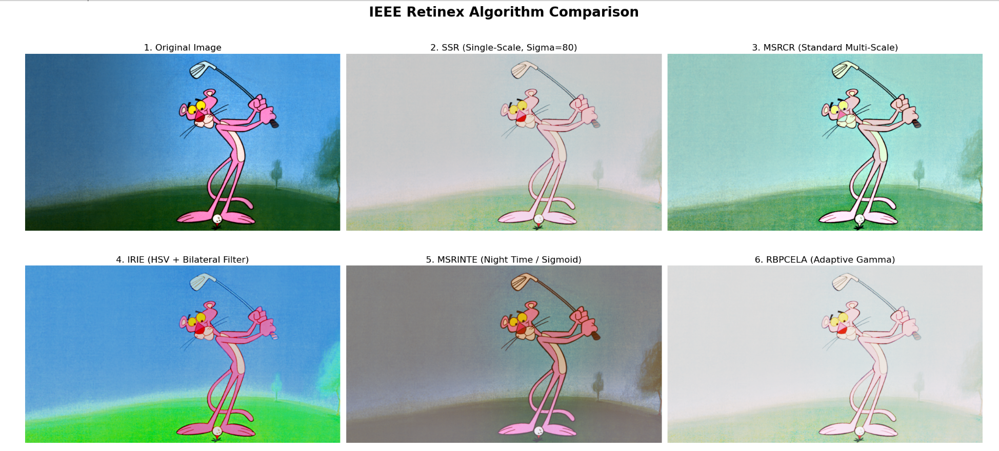
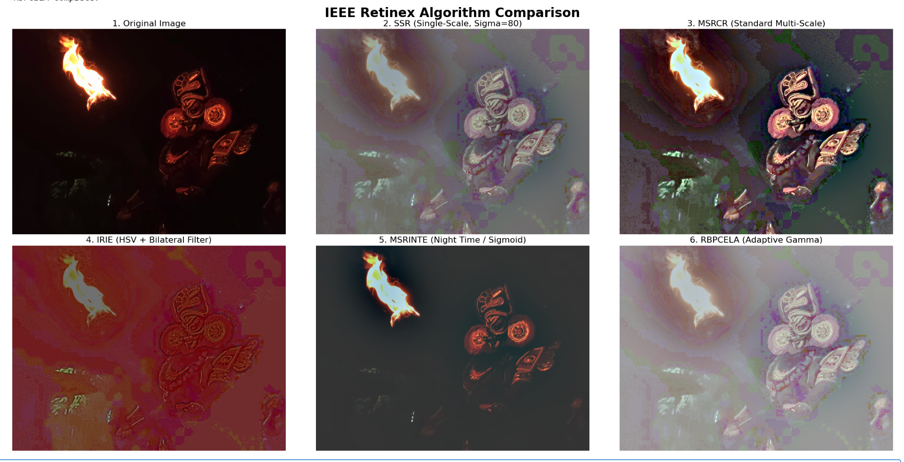

# Retinex Algorithm Comparison for Image Enhancement

<table>
  <tr>
    <td></td>
    <td></td>
    
  </tr>
</table>

## Overview
Retinex theory (coined from the terms *Retina* + *Cortex*) states that an image can be separated into two main components: its reflectance and its illuminance. This repository implements several classic and modern Retinex-based algorithms to mathematically estimate and remove the illuminance factor, thereby enhancing image quality. 

The objective of this project is to conduct a comparative study of these algorithms across varying lighting conditions (daylight, night time, heavy backlighting, and synthetic textures) to evaluate their contextual strengths and mathematical limitations.

**Reference Literature:** This implementation and comparative study is based on the 2018 IEEE conference paper: *[A study on Retinex based method for image enhancement](https://ieeexplore.ieee.org/abstract/document/8398874)*.

## Methods Implemented
* **SSR (Single Scale Retinex):** The foundational algorithm utilizing a single Gaussian surround function to estimate illumination.
* **MSRCR (Multi Scale Retinex with Colour Restoration):** Evaluates the image across multiple scales (radii) to preserve fine detail while reducing halos, followed by a color restoration function to counter the "graying" effect of standard Retinex.
* **IRIE (Improved Retinex Image Enhancement):** Operates in the HSV color space and utilizes a Bilateral Filter to preserve sharp edges while smoothing illumination variations.
* **MSRINTE (MSR Improvement for Night Time Enhancement):** Specifically tuned for extreme low-light conditions, utilizing a Sigmoid transfer function to dynamically compress highlights and expand shadow details.
* **RBPCELA (Retinex Based Perception Contrast Enhancement using Lumination Adaptation):** Employs global luminance adaptation via an adaptive gamma curve to prevent the spatial haloing effects common in other Retinex methods.

## Getting Started

### Prerequisites
This implementation relies on standard Python scientific and image processing libraries. You can install the required dependencies using pip:

```bash
pip install notebook numpy matplotlib opencv-python
```

### Usage
You can explore the implementations in two ways:
1. **Interactive Demo:** Open the `.ipynb` Jupyter Notebook to step through the algorithms visually and see the comparative grids.
2. **Standalone Script:** Run the `.py` script from your terminal to process individual images through the pipeline. 

## Dataset & Testing Methodology
To facilitate immediate testing and reproducibility, a set of sample images is provided in the `images/` directory of this repository. 

These images were specifically selected to stress-test the algorithms and break standard color-space and filtering assumptions. The test cases include:
* Standard daylight with haze/glare
* High-frequency organic textures (macro wildlife, fur, foliage)
* Extreme backlighting (silhouettes)
* Extreme low-light with point light sources (nocturnal fires)
* Synthetic/Cell-shaded images (uniform color boundaries)

Users are encouraged to run the program using these provided assets to replicate the observations below.

PS: Most of these images were clicked by me :)

## Observations & Results

Our comparative analysis indicates that there is no universal, "one-size-fits-all" Retinex algorithm. Each method exhibits specific mathematical strengths and context-dependent limitations:

* **MSRCR (Multi-Scale Retinex with Color Restoration):** Testing indicates that MSRCR is the most robust algorithm for standard outdoor, daylight, and moderately hazy conditions. It effectively balances dynamic range compression with detail rendition while successfully mitigating the color desaturation common in single-scale approaches. However, it exhibits a tendency to introduce artificial color shifts (hue distortions) when applied to strongly monochromatic or highly saturated natural scenes.
  
* **MSRINTE:** This algorithm demonstrates specialized efficacy in extreme low-light and nocturnal environments. By utilizing a sigmoid transfer function, it successfully preserves black levels and atmospheric contrast without aggressively amplifying hidden sensor noise. Conversely, it is entirely unsuited for daytime or well-lit images, where it induces severe, unnatural underexposure.
  
* **RBPCELA:** This method proves highly effective for scenes characterized by extreme backlighting or silhouetted subjects. Because its lumination adaptation relies on a global adaptive gamma curve rather than local spatial filtering, it uniquely avoids the undesirable "haloing" artifacts that frequently plague multi-scale algorithms at high-contrast boundaries. It does, however, tend to flatten global contrast in uniformly lit images.
  
* **IRIE:** Our results show that IRIE’s reliance on bilateral filtering within the HSV color space makes it highly unstable when processing high-frequency organic textures (e.g., fur, foliage, macro wildlife), often generating severe visual artifacts. However, it performs exceptionally well on synthetic, cell-shaded, or digital imagery, where it successfully smooths flat color gradients while sharply preserving distinct geometric boundaries.
